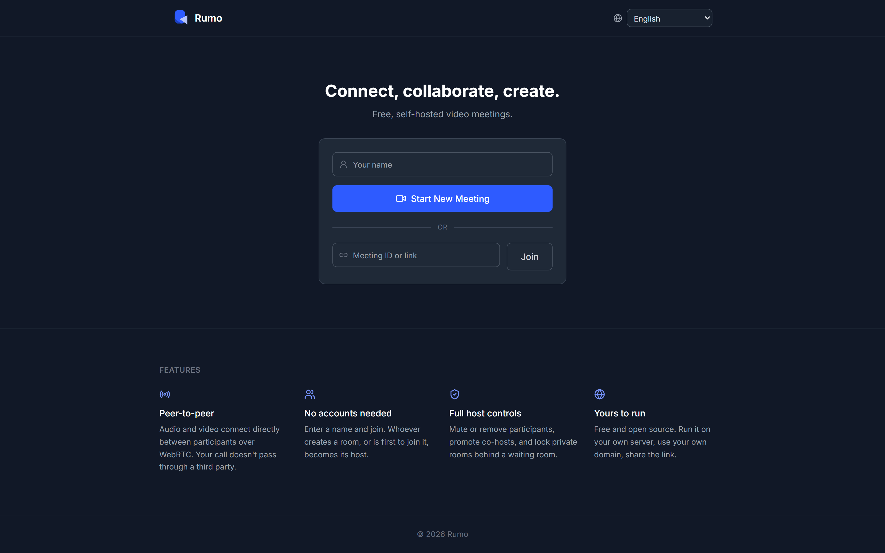
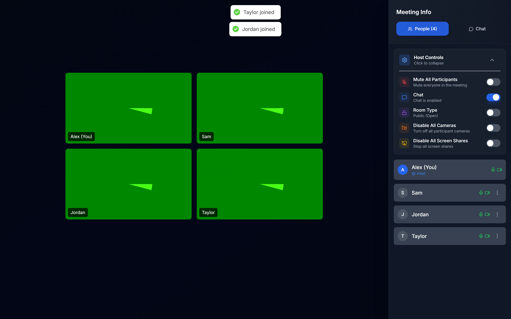
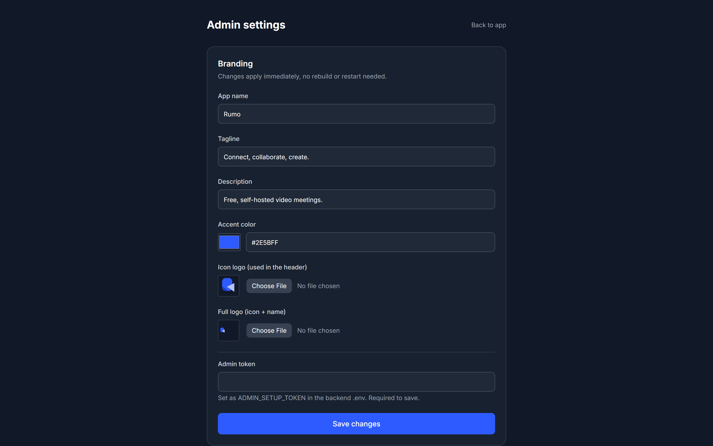

<p align="center">
  
</p>

<p align="center">
  <b>Free, self-hosted video meetings. No accounts, no per-seat pricing, no third-party platform.</b>
</p>

<p align="center">
  <a href="LICENSE"></a>
  
  
  = 22">
  <br />
  <br />
  <a href="https://www.producthunt.com/products/rumo-2?embed=true&amp;utm_source=badge-featured&amp;utm_medium=badge&amp;utm_campaign=badge-rumo-2" target="_blank" rel="noopener noreferrer"></a>
<a href="https://alternativeto.net/software/rumo/about/?utm_source=badge&utm_medium=referral" target="_blank">
  
</a>
</p>


Spin it up on your own server and share the link. Built with WebRTC for peer-to-peer audio/video, Socket.IO for signaling and real-time chat/host controls, React on the frontend, and Postgres for room state.

**Live docs site:** https://brahmjotsingh0.github.io/rumo/

<p align="center">
  
</p>
<p align="center">
  
  
</p>

## Contents

- [Features](#features)
- [How it compares](#how-it-compares)
- [Quick start (Docker)](#quick-start-docker)
- [Manual setup](#manual-setup-without-docker)
- [Configuration](#configuration)
- [How hosting works](#how-hosting-works)
- [Project structure](#project-structure)
- [Documentation](#documentation)
- [Security notes](#security-notes)
- [Contributing](#contributing)
- [License](#license)

## Features

- **Video/audio calls**: adaptive quality, screen sharing, background blur and virtual backgrounds (upload your own or pick from an admin-managed gallery), low-bandwidth mode for poor connections
- **Real noise suppression**: RNNoise, a machine-learned model that separates voice from background noise, running entirely client-side via WebAssembly - not just a volume gate that mutes you between words (falls back to that gate, then to no processing, if a browser doesn't support it)
- **Guest access**: enter a name and join, no account required. Whoever creates a room is its host, with a signed token so reclaiming host status after a reconnect can't just be asserted by any client
- **Host controls**: mute/remove participants, co-hosts with configurable permissions, lock the meeting, waiting room and optional PIN for private rooms, participant cap, host transfer
- **Schedule for later**: optional date/time on a room, with one-click "Add to Google Calendar / Outlook" links and an `.ics` download, generated entirely client-side
- **Raise hand, emoji reactions, and live captions** (browser speech-to-text, relayed to the room - no audio ever leaves the browser for it)
- **Local recording**: record your own camera and mic straight to your device - no recording server involved (see [How it compares](#how-it-compares) for how this differs from server-side recording)
- **Real-time chat** with rate limiting, and small in-call file sharing (images preview inline, everything else is a download card)
- **Live polls**: host/co-host asks a quick multiple-choice question, votes update live, only counts are shown (never who voted for what)
- **Shared whiteboard**: a live drawing surface everyone in the room sees, resolution-independent so it looks right on any screen size
- **Breakout rooms**: split participants into separate sub-rooms with one click; each is a real Rumo room under the hood, so it inherits the same join flow, chat, and controls as the main one
- **Six meeting layouts**: grid, speaker, sidebar, spotlight, interview, and webinar, picked from a single layout menu
- **Decluttered in-call UI**: a small control bar (reactions and raise-hand share one menu, less-used tools live under one "More"), a collapsible side panel, and host controls/breakout rooms tucked into their own "Host tools" panel instead of crowding the participant list for everyone
- **Embeddable**: drop a meeting into your own site as an iframe, with a small JS API (`embed.js`) to control it and listen for events - see [`docs/EMBEDDING.md`](docs/EMBEDDING.md)
- **Webhooks, including Slack/Discord**: optional POST requests for room/participant lifecycle events - HMAC-signed for your own integrations, or shaped as a plain-text message so `WEBHOOK_URL` can point straight at a Slack/Discord incoming webhook
- **Connection quality monitoring** and automatic reconnection
- **Configurable branding**: change the name, logo, tagline, and accent color from an admin panel in the browser, or a JSON file - no rebuild required
- **Feature flags**: turn off chat, screen sharing, co-hosts, polls, whiteboard, breakout rooms, or any other optional control for the whole instance from the admin panel - including the admin panel's own visibility (on by default)
- **Built-in i18n**: every UI string lives in one `lang.json`, add a language by adding a column
- **One-command HTTPS**: point a domain at your server and the installer sets up a reverse proxy with automatic, auto-renewing certificates
- **Installable**: add it to your home screen/dock as a PWA - the app shell installs and updates itself, the API and Socket.IO connection are always live (nothing meeting-related is cached for offline use)
- **Update notices**: a small, dismissible "update available" notice on the landing page and in `/admin` when a newer release exists, from a daily anonymous check against GitHub - no data about your instance is sent, and it's one setting to turn off entirely

## How it compares

Rumo is built for the opposite end of the spectrum from Jitsi Meet: instead of a platform that scales to huge public calls, it's the smallest, most transparent thing you can fully own for a small team, class, or family. One script, one small codebase, minimal server, and the server never touches your audio or video.

| | Rumo | Jitsi Meet |
|---|---|---|
| License | MIT | Apache 2.0 |
| Setup | One `docker-compose.yml`, up and running in minutes | Several services to stand up and keep in sync: web, videobridge, jicofo, prosody |
| Server footprint | Light enough for a $5 VPS for a handful of concurrent calls | Videobridge wants meaningfully more CPU/RAM per concurrent call |
| Media routing | Peer-to-peer WebRTC mesh; the server never sees your audio or video | SFU (Jitsi Videobridge) relays media through the server |
| Best fit | Small, private meetings where simplicity, low footprint, and full control matter most | Larger meetings and webinars where scale matters more than footprint |
| Branding & white-labeling | Full control from an admin panel, no rebuild: name, logo, color, and which features even show up | Configurable via `interface_config.js`, needs a rebuild to apply |
| In-call controls | A handful of core buttons plus one "More" menu; host controls and breakout rooms live in their own panel, off by default for regular participants | Feature-rich toolbar, more icons visible at once |
| Codebase | Small enough to read end to end in an afternoon | Large, mature, many moving parts |
| Translations | 20 languages in one `lang.json` file, trivial to extend | Larger, more established translation project |
| Recording | Local only: record your own camera+mic to your device, no server involved | Server-side, via Jibri, for the whole call |
| Mobile | Browser only for now, works fine on mobile browsers | Native iOS and Android apps |

Rumo isn't trying to out-scale Jitsi, it's trying to be the thing you can stand up in five minutes, fully understand, and fully brand as your own. If you need to reliably host large public webinars, Jitsi Meet or [BigBlueButton](https://bigbluebutton.org/) are more proven at that scale.

## Quick start (Docker)

Requires [Docker](https://docs.docker.com/get-docker/) and Docker Compose.

```bash
git clone https://github.com/BrahmjotSingh0/rumo.git
cd rumo
./install.sh      # Windows: .\install.ps1
```

The script checks for Docker (and offers to install it on Ubuntu/Debian), generates `.env` with random secrets for anything you haven't already set, and runs `docker compose up -d --build`. Running it again later is safe: it won't overwrite secrets or settings you already have.

It asks for a domain name. Leave it blank to run on plain `http://localhost`, or give it one (with its DNS already pointing at this server) to have it start [Caddy](https://caddyserver.com/) as a reverse proxy and get you a free, auto-renewing HTTPS certificate:

```bash
./install.sh --domain meet.example.com --yes
```

Either way, once it's up:

- App: `http://localhost:5173` (or `https://your-domain`)
- Admin panel: `.../admin`, unlocked with the `ADMIN_SETUP_TOKEN` the script prints (also saved in `.env`) - use it to set the name, logo, tagline, and accent color without touching a file
- Backend health check: `http://localhost:5000/health`

The Postgres schema is applied automatically on first run (Docker only initializes an empty data volume, so this doesn't rerun on an existing one). If you're upgrading an existing instance from before a given release added a column, apply the difference by hand, e.g. for the "hide the admin page" setting: `ALTER TABLE branding_settings ADD COLUMN IF NOT EXISTS admin_page_enabled BOOLEAN DEFAULT true;`.

If `ufw` (Linux) or Windows Firewall is already active on the machine, the installer adds an allow rule for whichever ports this deployment actually uses - it never enables a firewall that wasn't already on, and never touches or removes any of your existing rules.

**Sharing a machine with other things:** Rumo's containers, volumes, and network are all namespaced under this project alone (Docker Compose prefixes them from the directory name), so they don't collide with other Docker projects. Postgres is never exposed to the host at all - only the backend container can reach it. The only host ports touched are `BACKEND_PORT`/`FRONTEND_PORT` (5000/5173 by default, override either in `.env` if something else already uses them) and, only in `--domain` mode, 80/443 for Caddy - which does need to be free if another reverse proxy is already bound to them.

> Camera/microphone access requires HTTPS in the browser (Chrome and Firefox both block `getUserMedia` on plain HTTP), except on `localhost`. The `--domain` flag above handles this for you; without it, you'll need your own reverse proxy with a TLS certificate in front of `frontend`/`backend`, with `CORS_ORIGIN`, `VITE_API_URL`, and `VITE_SOCKET_URL` pointed at the public HTTPS URLs.

## Manual setup (without Docker)

Requires Node.js 22+ and PostgreSQL. See [`backend/README.md`](backend/README.md) and [`frontend/README.md`](frontend/README.md) for full details.

```bash
# 1. Create the database and load the schema
createdb rumo
psql rumo < backend/database/schema.sql

# 2. Backend
cd backend
cp .env.example .env   # fill in DB credentials
npm install
npm run dev             # http://localhost:5000

# 3. Frontend (new terminal)
cd frontend
cp .env.example .env
npm install
npm run dev             # http://localhost:5173
```

## Configuration

### Branding

The easiest way: open `/admin` in your browser, enter the `ADMIN_SETUP_TOKEN` from your `.env`, and set the app name, tagline, description, logo, and accent color from a form. Changes apply immediately, no rebuild or restart.

Those settings live in Postgres. If you'd rather manage branding as a file (for scripted deployments, or if you never set `ADMIN_SETUP_TOKEN`), edit [`frontend/public/branding.json`](frontend/public/branding.json) instead:

```json
{
  "appName": "Rumo",
  "tagline": "Connect, collaborate, create.",
  "description": "Free, self-hosted video meetings.",
  "logoIcon": "/brand/icon.svg",
  "logoFull": "/brand/logo.svg",
  "primaryColor": "#2E5BFF"
}
```

This file is fetched at runtime too (edit it or bind-mount your own version over it; no rebuild needed), and acts as the fallback whenever nothing has been saved through the admin panel yet. `primaryColor` drives a full 50-900 Tailwind shade scale computed on load (see `frontend/src/utils/theme.js`), so buttons, badges, and focus rings across the landing and pre-join screens follow it automatically. Logo files live in `frontend/public/brand/`; replace them with your own SVG/PNG and update the paths above, or just upload one from `/admin`. `frontend/src/config/branding.js` holds the built-in defaults used if neither the admin panel nor `branding.json` set something.

> Scope note: the accent-color retheming above covers the landing and pre-join screens. The in-call UI (`MeetingPro.jsx`) is a large, separate surface that still uses fixed colors, aside from its own existing light/dark toggle in the in-call settings panel. Full accent-color coverage there is a good follow-up contribution.

### Languages

UI strings live in [`frontend/src/i18n/lang.json`](frontend/src/i18n/lang.json): one file, each string keyed by language code.

```json
"common.joinMeeting": { "en": "Join Meeting", "es": "Unirse a la reunión" }
```

To add a language, add its code and label to `languages`, then add that code to every entry in `strings`. The language switcher (top-right on the home screen) picks it up automatically. Currently ships with English and Spanish covering the landing and pre-join screens; in-call UI strings aren't translated yet, so contributions are welcome.

### TURN server (optional)

STUN (included, free, via Google's public servers) is enough for most networks. If some participants are behind restrictive NATs/firewalls and can't connect, run your own TURN server (e.g. [coturn](https://github.com/coturn/coturn)) and set `TURN_SERVERS` (backend) plus `VITE_TURN_URL`, `VITE_TURN_USERNAME`, `VITE_TURN_CREDENTIAL` (frontend).

### Room PINs, scheduling, and webhooks

Anyone creating a room from the home page can, under "Advanced options," set a PIN, a max participant count, and/or schedule it for later (which just shows calendar links instead of joining immediately - the room is real and joinable right away either way). The same options are available from `POST /api/rooms` if you're creating rooms from your own code - see [`docs/API.md`](docs/API.md).

To get notified about room/participant activity elsewhere (logging, chat-ops, your own dashboard), set `WEBHOOK_URL` in the backend's `.env` (and `WEBHOOK_SECRET` to have requests signed). Off by default - nothing is sent unless you set it. Set `WEBHOOK_FORMAT=slack` or `discord` and `WEBHOOK_URL` can point straight at that platform's incoming-webhook URL - a plain-text notification lands in the channel whenever a room starts/ends or someone joins/leaves, no bot, OAuth app, or extra service required.

### Host tools, breakout rooms, and hiding the admin page

Host and co-host controls (mute all, lock the room, disable cameras/screen share, co-host permissions) and breakout rooms both live behind a single "Host tools" button (shield icon) in the People tab, instead of sitting inline in the participant list where every attendee would see them. Breakout rooms are genuine Rumo rooms: assigning someone navigates their browser straight into one using the normal join flow, and a banner lets them return to the main room anytime - closing all breakout rooms doesn't move anyone back automatically, so give people a heads-up first.

The admin panel at `/admin` can itself be turned off for casual visitors from inside the panel (Admin access → Admin page enabled, on by default). This is the same trust level as every other feature flag - a presentation-layer deterrent, not a lockout: the real gate is still the `ADMIN_SETUP_TOKEN` check on every save, so entering the correct token on the "disabled" screen always gets you back in even with the toggle off.

## How hosting works

There are no user accounts. Whoever creates a room, or is first to join it, becomes its host for that session, and can transfer host, mute/remove participants, and lock the room. Anyone with the room link can join (optionally behind a PIN, see [Configuration](#configuration)) - that part is the same trust model as most link-based meeting tools.

Reclaiming host status after a reconnect is verified, not just asserted: the server hands a signed, short-lived token to whichever client is host, and requires it back before treating a reconnecting client as host again. It's still not an account system (there's no password or identity behind it, just proof "the server told this browser it was host a moment ago"), but it does mean another participant can't grant themselves host by editing their own browser storage.

## Project structure

```
rumo/
├── backend/             Express + Socket.IO API
│   ├── database/schema.sql
│   ├── src/
│   │   ├── config/       env + db connection
│   │   ├── models/       Room.js, BrandingSettings.js
│   │   ├── routes/       REST endpoints (/api/rooms, /api/settings, /health)
│   │   ├── services/     socketService.js: WebRTC signaling & room state
│   │   └── utils/
│   ├── uploads/          logos uploaded through /admin (gitignored)
│   ├── server.js
│   ├── Dockerfile
│   └── README.md
├── frontend/             React + Vite
│   ├── public/
│   │   ├── brand/        icon.svg, logo.svg
│   │   └── branding.json  fallback name/logo/tagline/color (see /admin)
│   ├── src/
│   │   ├── components/   Home, PreJoin, MeetingPro, Admin, meeting/*
│   │   ├── config/        branding.js (defaults + runtime loader)
│   │   ├── i18n/           lang.json + provider
│   │   ├── utils/theme.js  color-scale generator for primaryColor
│   │   └── hooks/, stores/, utils/
│   ├── Dockerfile
│   └── README.md
├── docs/                 API reference + GitHub Pages site
├── docker-compose.yml
├── Caddyfile             reverse proxy config used by the "proxy" profile
├── install.sh / install.ps1   one-command setup
├── CONTRIBUTING.md
├── SECURITY.md
└── .env.example
```

## Documentation

- [`docs/API.md`](docs/API.md): full REST + Socket.IO event reference
- [`docs/EMBEDDING.md`](docs/EMBEDDING.md): embed a meeting in your own site with `embed.js`
- [`backend/README.md`](backend/README.md): backend setup, env vars, scripts
- [`frontend/README.md`](frontend/README.md): frontend setup, branding, i18n, scripts
- [`CONTRIBUTING.md`](CONTRIBUTING.md): how to contribute, coding/docs style
- [`CODE_OF_CONDUCT.md`](CODE_OF_CONDUCT.md): expected behavior in issues, PRs, and discussions
- [`SECURITY.md`](SECURITY.md): supported versions, how to report a vulnerability, trust model
- [Live docs site](https://brahmjotsingh0.github.io/rumo/): a browsable landing page for the project

## Security notes

- All SQL is parameterized (`pg` placeholders); no string-built queries.
- Room PINs are bcrypt-hashed at rest, never stored or logged in plain text.
- Host-rejoin tokens are signed with `HOST_TOKEN_SECRET` (auto-generated at boot if you don't set one); see [How hosting works](#how-hosting-works).
- API rate limiting is on by default (`RATE_LIMIT_*` in `backend/.env.example`).
- The backend's `helmet` middleware sets a strict CSP - safe there since that server only ever returns JSON and static uploads, never the app itself.
- The frontend image (`frontend/nginx.conf`) also sets a CSP, `X-Content-Type-Options`, `Referrer-Policy`, and a `Permissions-Policy` that blocks features Rumo never uses. The CSP's `connect-src` is filled in at Docker build time from your own `VITE_API_URL`/`VITE_SOCKET_URL` (see `frontend/Dockerfile`), so it matches whatever backend origin you actually configured instead of a hardcoded guess. **If you change those URLs or add a custom TURN server, rebuild the frontend image and test a real call afterward** (screen share, camera, chat, and ideally a device on a different/restrictive network to confirm TURN still connects) - a CSP mismatch fails silently rather than with an obvious error.
- No cookies or sessions are used (guest model, see [How hosting works](#how-hosting-works)), so `CORS_CREDENTIALS` defaults to `false`.
- TLS is handled by the optional Caddy reverse proxy (`./install.sh --domain ...`) or your own proxy in front; the app itself doesn't terminate HTTPS.
- The admin panel (`/admin`, `/api/settings/*`) is gated by `ADMIN_SETUP_TOKEN`, compared with a timing-safe check. Leave it unset to disable branding changes entirely. The "Admin page enabled" toggle in the panel only hides the form behind a lock screen for people without the token - it doesn't change what the token check itself allows.
- `.env`/`.env.production` are gitignored everywhere in this repo. Never commit real credentials, and run `npm audit` in both `backend/` and `frontend/` before bumping dependencies.

## Contributing

Issues and PRs welcome. See [`CONTRIBUTING.md`](CONTRIBUTING.md) for setup, coding style, and how to add a language.

## License

MIT. See [LICENSE](LICENSE).
